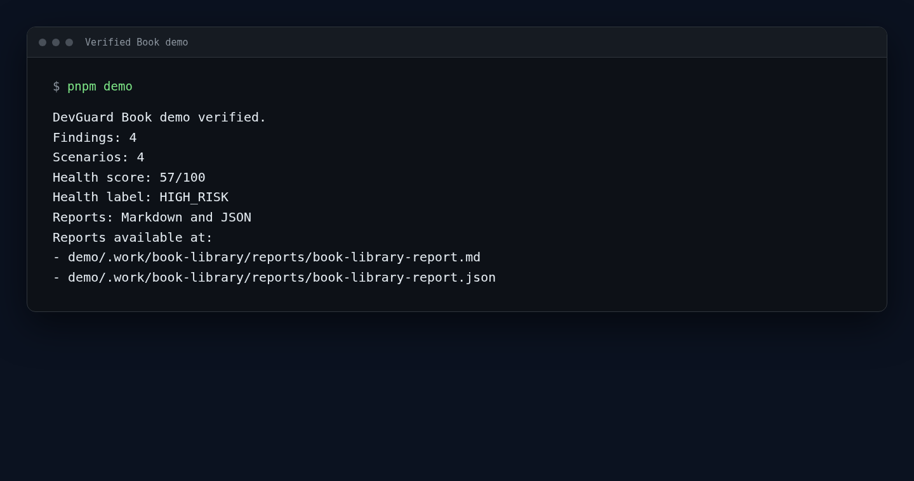
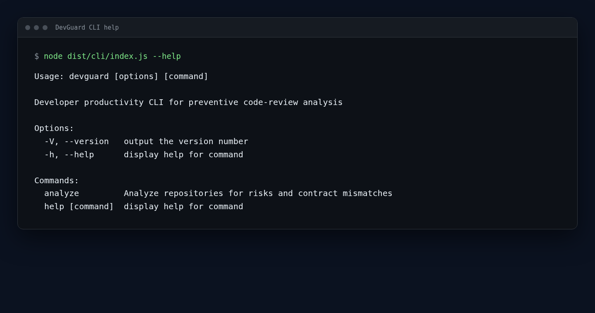
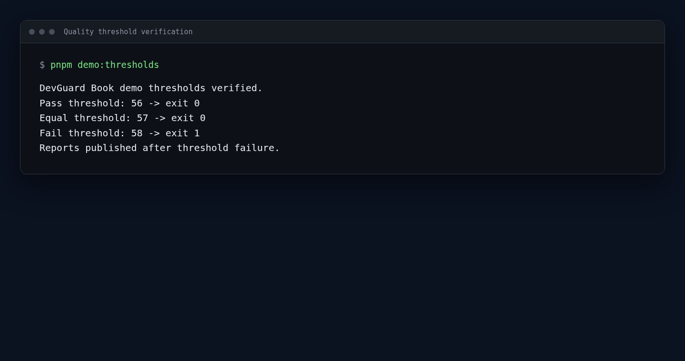
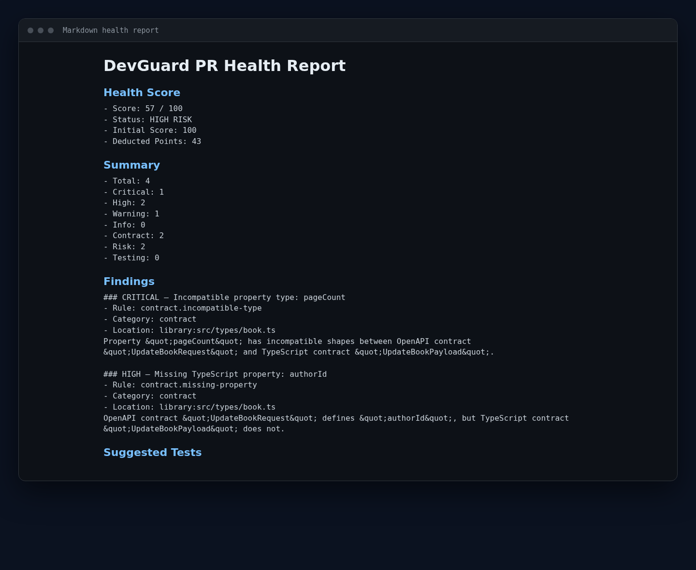

# DevGuard

Deterministic contract and change-risk analysis for local Git repositories.

DevGuard compares configured local OpenAPI schemas, TypeScript interfaces or object-literal type aliases, changed repository files, and configured risk patterns. It produces contract and repository-risk findings, deterministic test scenarios, a health score, and Markdown and JSON reports. The current MVP analyzes local Git repositories only.

## The problem

Frontend and backend contracts can drift while a change also touches sensitive files or lacks related test evidence. Reviewers need repeatable evidence rather than assumptions. DevGuard makes those checks explicit and deterministic for a configured local Git change set.

## What DevGuard does

- Analyzes one fullstack repository or one frontend plus one backend local Git repository.
- Compares changes against each configured base reference using Git merge-base-aware diffs.
- Loads configured local OpenAPI 3.x schemas and supported TypeScript declarations.
- Compares explicitly mapped OpenAPI schemas and TypeScript interfaces or object-literal type aliases.
- Detects configured sensitive-file changes and changed production files without expected related changed tests.
- Generates deterministic test scenarios, calculates one health score, and publishes Markdown and JSON reports.
- Supports an output-directory override, an explicit requirements-file override, `--fail-below`, and a verbose health-score summary.

The supported contract subset is intentionally narrow: primitive values, primitive arrays, required properties, TypeScript interfaces, and object-literal type aliases. Unsupported constructs are handled as warnings where supported by the analysis flow rather than as inferred semantics.

## Key properties

- **Deterministic:** structural findings, scoring, and scenario results are reproducible for the same repository state and configuration.
- **Local-first:** core analysis reads configured local Git repositories and local OpenAPI files.
- **Offline-capable:** analysis requires no network connection, LLM credentials, or LLM service.
- **OpenAPI-authoritative:** configured OpenAPI schemas define the contract expectations used for mappings.
- **Safe outcomes:** operational failures do not create fake reports or scores.

## Verified Book demo

Run the primary judge-friendly demo command:

```sh
pnpm demo
```

It builds the production CLI, recreates a deterministic fictional Book repository, runs the built CLI with verbose output, verifies the generated reports, and leaves them available for inspection. Expected result:

- Score: `57/100`
- Label: `HIGH_RISK`
- Findings: `4`
- Scenarios: `4`



The verified finding codes are:

1. `contract.incompatible-type` — OpenAPI `pageCount` is an integer while the TypeScript declaration uses `string`.
2. `contract.missing-property` — required OpenAPI `authorId` is absent from the TypeScript declaration.
3. `risk.sensitive-file-change` — the fictional access-policy file changed.
4. `risk.missing-related-tests` — a service changed without expected related-test evidence.

After `pnpm demo`, inspect:

- `demo/.work/book-library/reports/book-library-report.md`
- `demo/.work/book-library/reports/book-library-report.json`

Then remove the generated workspace when finished:

```sh
pnpm demo:clean
```

| Command                | Behavior                                                                             |
| ---------------------- | ------------------------------------------------------------------------------------ |
| `pnpm demo`            | Builds, runs, and verifies the Book analysis; leaves reports available.              |
| `pnpm demo:setup`      | Recreates the deterministic Book Git repository without analysis or reports.         |
| `pnpm demo:verify`     | Recreates the repository, runs verified analysis, and validates reports.             |
| `pnpm demo:thresholds` | Verifies threshold `56` and `57` exit `0`, and `58` exits `1` after reports publish. |
| `pnpm demo:clean`      | Removes only `demo/.work/book-library/`; it is safe to run again when absent.        |

## Prerequisites

- Node.js `24` (the repository specifies Node 24 and the package requires `>=24.0.0`).
- pnpm `9.15.9`.
- Git CLI.
- An operating system with Node.js and Git available. The local MVP is validated through its deterministic repository and process checks; it does not claim a broader platform certification.

## Installation and setup

The package is npm-compatible and locally verified, but it is **not yet published**. The planned GitHub repository URL is `https://github.com/ZarakiLancelot/devguard`; its public availability is not yet confirmed.

When the repository is available, a development checkout can use:

```sh
git clone https://github.com/ZarakiLancelot/devguard.git
cd devguard
corepack enable
pnpm install
pnpm build
node dist/cli/index.js --help
```

After npm publication, the intended global installation command will be:

```sh
npm install --global @edwineinsen/devguard
```

Until then, use a repository checkout or the verified local package workflow below.

### Verified package workflow

```sh
pnpm verify:package
```

This release-integrity command builds production output, exercises the pack lifecycle, validates the package boundary, installs the local tarball offline into an isolated consumer, invokes the installed `devguard` binary shim, analyzes the Book demo, verifies threshold behavior, and cleans generated verification artifacts. It is more comprehensive than the primary demo and is not the fastest way to inspect DevGuard.

## Quick start

Create a `.devguard.yml` for a local Git repository, then run:

```sh
devguard analyze local --config .devguard.yml
```

A successful run publishes both Markdown and JSON reports. The Book configuration below is a complete verified example.

## Configuration

Configuration is YAML with `version: 1`. A repository `path`, configured requirements file, and output directory resolve from the directory containing the configuration file. OpenAPI and TypeScript mapping paths resolve within their configured repository. Supported repository roles are `frontend`, `backend`, and `fullstack`.

```yaml
version: 1

repositories:
  library:
    path: ./library
    baseRef: demo-base
    role: fullstack

openapi:
  repository: library
  path: docs/openapi.yaml

contracts:
  - name: UpdateBook
    openapiSchema: UpdateBookRequest
    typescript:
      repository: library
      file: src/types/book.ts
      type: UpdateBookPayload

risk:
  sensitivePatterns:
    - config/access-policy.json

testing:
  framework: scenario-only

output:
  directory: reports
  markdown: book-library-report.md
  json: book-library-report.json
```

The configuration schema also supports optional `risk.productionPatterns`, `testing.testPatterns`, and `testing.requirementsFile`. Contract mappings are explicit: each mapping names an OpenAPI schema and its TypeScript declaration target.

## CLI reference

```text
devguard analyze local --config <path> [--requirements <path>] [--output <path>] [--fail-below <score>] [--verbose]
```



| Option                  | Required | Accepted value                  | Behavior                                                         |
| ----------------------- | -------- | ------------------------------- | ---------------------------------------------------------------- |
| `--config <path>`       | Yes      | Configuration-file path         | Loads the required `.devguard.yml` configuration.                |
| `--requirements <path>` | No       | Explicit requirements-file path | Overrides configured requirements input for this invocation.     |
| `--output <path>`       | No       | Output directory path           | Overrides only the configured/default output directory.          |
| `--fail-below <score>`  | No       | Decimal from `0` through `100`  | Returns a quality outcome when the score is below the threshold. |
| `--verbose`             | No       | Flag                            | Prints the health score after successful publication.            |

`--fail-below` accepts digits with an optional decimal fraction after trimming outer whitespace, such as `80`, `80.5`, or `100`. It rejects signs, exponent notation, non-decimal forms, malformed values, and values outside `0–100`. The comparison is `healthScore < threshold`, so equality passes.

## Terminal output and exit codes

Default successful analysis output is exactly:

```text
DevGuard local analysis completed.
Reports published.
```

With `--verbose`, the success output includes the score, for example:

```text
DevGuard local analysis completed.
Reports published.
Health score: 57/100
```

A threshold miss prints:

```text
DevGuard quality threshold not met.
```

| Exit code | Meaning                                                                      |
| --------- | ---------------------------------------------------------------------------- |
| `0`       | Successful analysis and publication, help/version, or a satisfied threshold. |
| `1`       | Analysis and publication succeeded, but the score was below `--fail-below`.  |
| `2`       | Operational or internal failure.                                             |
| `3`       | Command usage error, including invalid syntax or invalid threshold input.    |

Exit `1` is a quality outcome, not an analysis crash: Markdown and JSON reports are published before the threshold is evaluated.



## Reports

Every successful analysis publishes both configured report files:

- Markdown is the reviewer-readable report: repository comparisons, health score, summaries, findings, evidence, recommendations, suggested tests, and warnings.
- JSON is the machine-readable serialized report model.



Reports include findings, deterministic scenario suggestions, score and label, and repository metadata. Findings and report collections use stable ordering where implemented. The JSON output is useful for local automation, but this MVP does not promise a separately versioned public JSON API.

## Health score

DevGuard starts at `100`; higher values are healthier. Current severity deductions are critical `20`, high `10`, warning `3`, and info `0`. For findings sharing a root cause, only the highest applicable severity deduction is applied while all findings remain visible.

Current health labels are:

| Score    | Label           |
| -------- | --------------- |
| `90–100` | `HEALTHY`       |
| `75–89`  | `REVIEW`        |
| `50–74`  | `HIGH_RISK`     |
| `0–49`   | `CRITICAL_RISK` |

## Privacy, determinism, and offline operation

Analysis runs locally. DevGuard does not require an LLM, does not require network access for core analysis, and does not execute untrusted target-project code. Reports contain repository-relative analysis information rather than configuration or workspace absolute paths.

For the same repository state and configuration, structural findings, score, and scenario results are deterministic. Report analysis identifiers and generated timestamps may vary between runs. `pnpm verify:package` explicitly verifies offline installation from a local tarball.

## Architecture

```text
RepositorySource
  → configuration
  → Git diff
  → OpenAPI and TypeScript normalization
  → contract analysis
  → risk analysis
  → test-scenario generation
  → health score
  → Markdown and JSON publication
  → optional quality-threshold outcome
```

The main layers are `sources`, `config`, `application`, `modules`, `reports`, and `cli`.

## Development

```sh
pnpm install
pnpm typecheck
pnpm test
pnpm format:check
pnpm lint
pnpm build
pnpm build:prod
pnpm verify:package
```

The validated release-preparation baseline is 53 test files and 1,270 tests. The count is a current validation result, not a permanent compatibility promise.

## Package contents

The production archive includes only `dist/`, `README.md`, `LICENSE`, and `package.json`. It excludes source tests, fixtures, internal specifications, demo templates, development configuration, source maps, and generated reports.

The package boundary is checked by `pnpm verify:package` and `npm pack --dry-run --ignore-scripts --json`. Current file count and sizes are verified during release preparation and may change when public documentation changes.

## Limitations

- Local repositories only; no GitHub pull-request integration or remote repository fetching.
- Explicit OpenAPI-to-TypeScript mappings are required.
- OpenAPI and TypeScript support is intentionally limited to the documented MVP subset.
- TypeScript-only payload properties absent from authoritative OpenAPI are not reported.
- No automatic code fixes and no automatic test-file creation.
- Deterministic scenario suggestions are not executable tests by themselves.
- Not a vulnerability scanner or a complete security scanner.
- No LLM-generated analysis and no hosted service.

## Roadmap

Future work may include a GitHub pull-request source, CI integration, broader OpenAPI support, broader TypeScript type support, executable test generation, and richer report visualization.

## Bootcamp context

DevGuard was created for the CódigoFacilito Kiro Bootcamp DevTools/Productivity challenge.

## License

MIT © 2026 Edwin Einsen Vásquez Velásquez. See [LICENSE](LICENSE).
